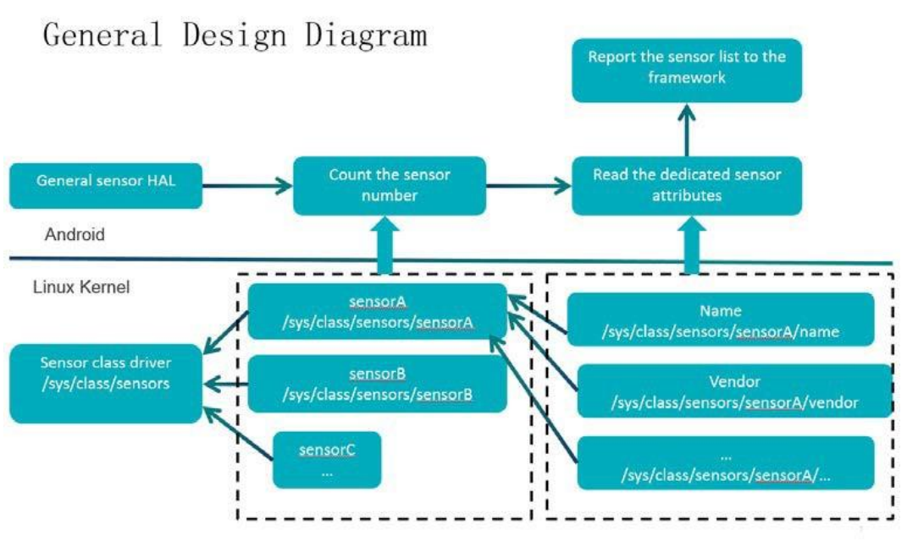

# Linux Sensor Drivers #

Sensor Driver在Linux中属于一类特殊的input device。这类Sensor能测量设备的各种
物理信息例如温度、加速度、姿态等，并通过input subsystem上报事件供用户空间程序
读取。

> 本文所述均针对Qcom Android Platform
> drivers/input/misc/mmc3416x.c是一个不错的sensor driver sample，本文以该driver
> 为基础介绍

0.Index
-------

- Device Initialization
- Sensor Class

1.Device Initialization
-----------------------

和绝大多数片外外设一样，设备的初始化时driver要做了首要事情，必须在driver probe
期间，将设备初始化到正常工作的状态。

大多数设备的初始化工作具有一定的相似性，大致可以归纳为：

* Memory allocation
* Get regulator and initialize power(use linux regulator framework)
* Pin configuration(use linux pinctrl framework)
* Initialize GPIO and reset the device
* IRQ(top half/bottom half)
* Userspace interface(proc/sysfs/input/char or misc device,etc.)

> 以上只是一个综合的概括，某些操作并非必要操作，也不一定所有的device driver都
> 需要这些操作。例如使用usb interface的device就没有reset GPIO and IRQ GPIO与主控相连。

MMC3416x系列IC是三轴磁力传感器，内置信号处理器以及I2C总线，与主控通过I2C总线相连。
其在probe函数中完成对mmc3416x的初始化工作：

```
mmc3416x_power_init();
mmc3416x_check_device();
mmc3416x_init_input();
mmc3416x_power_set();
```

mmc3416x没有GPIO与主控相连，因此也不存在IRQ也Reset。只有当Userspace打开了这个
sensor后，driver才会启动一个delayed work周期性report data。


2.Sensor Class
--------------

为了让sensor device更为通用，内核提炼了sensor device的通用属性和操作，建立了
`sensor_class`, 这样用户空间就可以使用通用的接口来获得sensor的属性和操作sensor
device了。

> 不同SoC厂商的实现方式有所差异，Qcom Android platform下整个Sensor framework
> 从上至下依次为SensorManager -> Sensor HAL -> Kernel Sensor Driver，Qcom在
> 内核中定义了`sensor_class`, 这样Sensor HAL就可以用统一的接口来访问各种Sensor了

Qcom Kernel使用设备驱动模型中的class来抽象sensor device并使用sysfs向用户空间
暴露通用的接口。

Qcom Sensor HAL


这部分代码位于`drivers/sensors/sensors_class.c`

以mmc3416x为例：

```
static struct sensors_classdev sensors_cdev = {
	.name = "mmc3416x-mag",  /* sensor name */
	.vendor = "MEMSIC, Inc", /* vendor name */
	.version = 1,	/* version */
	.handle = SENSORS_MAGNETIC_FIELD_HANDLE,
	.type = SENSOR_TYPE_MAGNETIC_FIELD, /* sensor type */
	.max_range = "1228.8", /* max range value */
	.resolution = "0.0488228125", /* resolution */
	.sensor_power = "0.35", /* power */
	.min_delay = 10000,	/* delay time when polling */
	.max_delay = 10000, 
	.fifo_reserved_event_count = 0,
	.fifo_max_event_count = 0,
	.enabled = 0,	/* flag */
	.delay_msec = MMC3416X_DEFAULT_INTERVAL_MS,
	.sensors_enable = NULL,  /* enable sensor */
	.sensors_poll_delay = NULL, /* set poll delay time */
};

static int mmc3416x_probe(struct i2c_client *client,
		const struct i2c_device_id *id)
{
	/* ... */

	memsic->cdev = sensors_cdev;

	/*
	 * Sensor HAL will write a positive value to /sys/class/sensors/sensorA/enable
	 * to enable sensorA, thus, mmc3416_set_enable will be called, and
	 * in this function, a delayed work will be queued, the report work will
	 * be done in the delayed work.
	 * To disable sensor, write zero to /sys/class/sensors/sensorA/enable
	 */
	memsic->cdev.sensors_enable = mmc3416x_set_enable; /* enable sensor*/
	memsic->cdev.sensors_poll_delay = mmc3416x_set_poll_delay;

	/*
	 * register sensor device to the sensor core, some generic attribute
	 * file like name/vendor/version/... will be created, the access path
	 * in userspace is /sys/class/sensors/sensorA/.
	 */
	res = sensors_classdev_register(&memsic->idev->dev, &memsic->cdev);
	if (res) {
		dev_err(&client->dev, "sensors class register failed.\n");
		goto out_register_classdev;
	}

	/* ... */
}

```


